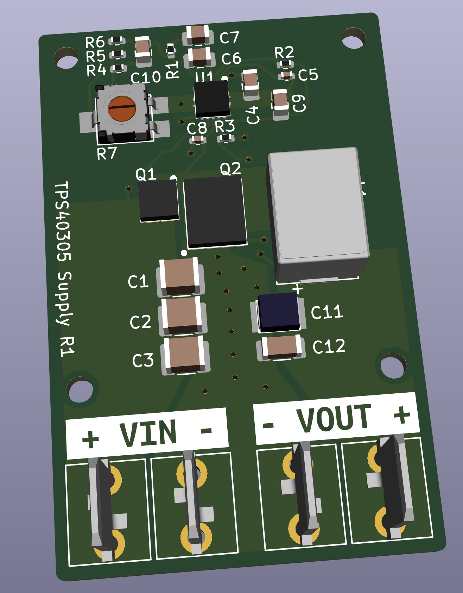

# TPS40305 Supply
Texas Instruments TPS40305 based power supply.

If you're going to make this beware: This is the first version and I haven't built one yet. I'm waiting for PCBs to come in and then I'll test the design and post any issues here.

Initially set to:
- Input: DC 4 V - 5.5 V
- Output: 1.5 V at 25 A
